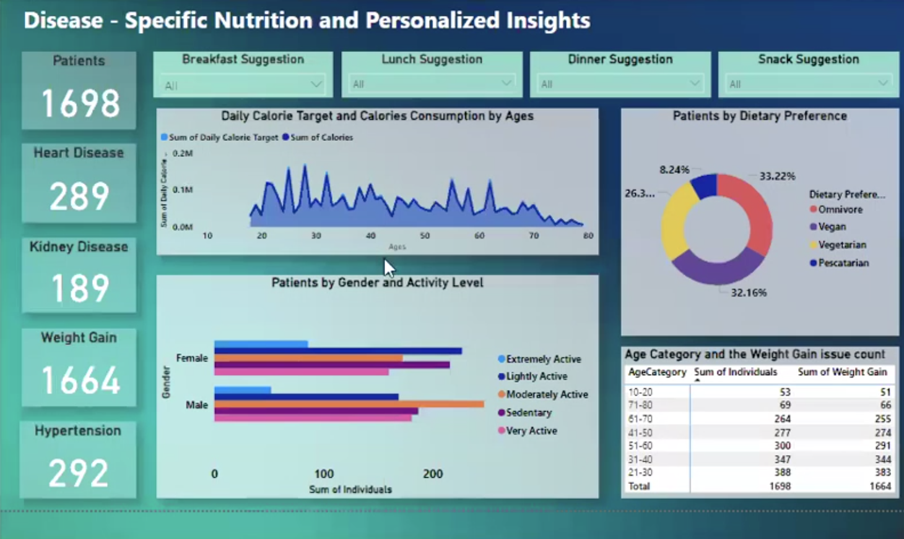

# 📊 Disease-Specific Nutrition and Personalized Insights Dashboard

A Power BI dashboard analyzing the relationship between nutrition and chronic diseases, with personalized diet insights based on real-world data.

  

---

## 🔍 Project Overview

This project explores how nutrition patterns relate to chronic diseases such as:
- 🫀 Heart Disease  
- 🧠 Hypertension  
- 🧬 Kidney Disease  
- ⚖️ Weight Gain  

Built using **Power BI**, the dashboard includes interactive visuals and slicers for personalized analysis and dietary recommendations.

---

## 📁 Dataset

- **Source**: Kaggle  
  *Dataset Name*: “Nutrition Daily Meals in Disease Cases”  
- **Key Features**:
  - Daily calorie consumption and targets  
  - Age, gender, height, and weight  
  - Dietary preferences (omnivore, vegan, vegetarian, pescatarian)  
  - Meal suggestions: breakfast, lunch, dinner, snacks  
  - Disease conditions associated with each patient  

---

## 🧹 Data Preprocessing

The dataset was transformed using Power Query:
- Removed **missing values**, **outliers**, and **duplicates**
- Split multi-value disease column into individual binary columns
- Standardized column names and data types
- Created custom columns for visual analysis

---

## 📊 Dashboard Features

- **Cards**:
  - Total number of patients
  - Count of patients with each disease
- **Area Chart**:
  - Calorie target vs. actual intake by age
- **Donut Chart**:
  - Percentage distribution of dietary preferences
- **Clustered Bar Chart**:
  - Gender vs. physical activity levels
- **Matrix Table**:
  - Disease counts by age group
- **Slicers**:
  - Filter by meal recommendations (breakfast, lunch, dinner, snacks)
- **Drillthrough Pages**:
  - Age, gender, and dietary preference vs. disease  
  - Activity level and demographics vs. disease pattern

---

## 📈 Insights & Recommendations

- Majority of patients suffer from **weight gain**
- Patients above 70 have **lower calorie intake**
- **Omnivores and vegans** are the most common diet types
- **Males with moderate activity** show higher disease incidence
- Suggest promoting **physical activity** and **calorie-balanced diets** for better outcomes

---

## ▶️ Video Walkthrough

📺 [Watch on YouTube](https://youtu.be/bSx0bX2rUIY?si=3dQRB2lsqcLsuQvX)  

---

## 🛠 Tools & Technologies

- **Power BI** – Data transformation and visualization  
- **Power Query** – Data cleaning and feature engineering  
- **Kaggle Dataset** – Public health nutrition data  

---

